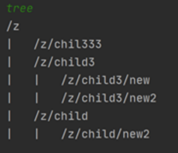

# ZooKeeper-homework

Solution to the assignment from Distributed Systems class to learn about Apache ZooKeeper framework, znodes and watches.

This simple app has feature of printing znode tree structure, among others.

